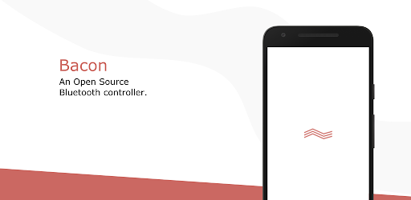

# The Bacon Project

An open source Bluetooth controller application for mobile devices.

## Development 🛠️

This app is built using `react-native`, make sure to have it setup to get started. Currently only Android is supported.

This uses [react-native-ble-manager](https://github.com/innoveit/react-native-ble-manager) internally to handle BLE connection.

Note: Support for iOS would come after polishing essential features of the App. However, testers/contributors are still welcome.

## Contributing 🤔

Help Sushi - Personal Finance improve, please create an issue for bugs or feature request.

Pull requests are welcome as well.

## Supported BLE Devices ⚙️

- Should work on majority of Bluetooth (BLE) modules and devices
- Tested working on Arduino BLE modules Ex. AT-09, MLT-BT05, HM-10
- Tested working on ESP32 modules with BLE support
